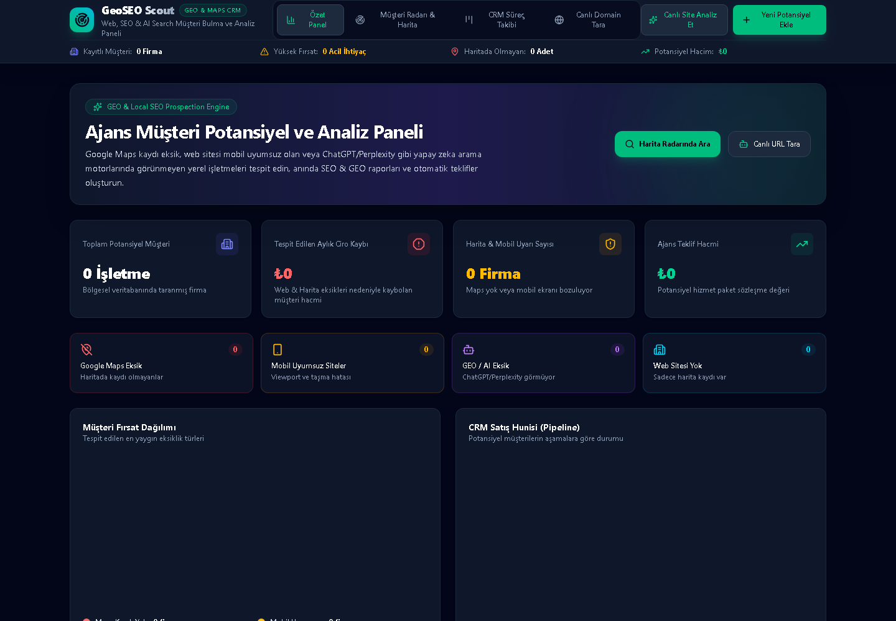

# GeoSEO Lead Engine

Yerel işletmeleri bölge ve sektöre göre keşfeden, web sitelerini teknik SEO/GEO sinyalleriyle denetleyen ve kanıta dayalı fırsat puanlarıyla kalıcı bir CRM akışına aktaran tam yığın web uygulaması.

[](https://github.com/LyrexD/geoseo-lead-engine/actions/workflows/ci.yml)




## Neden bu proje?

Ajansların ve bağımsız geliştiricilerin potansiyel müşterileri yalnızca listelemek yerine neden fırsat olduklarını açıklayabilmesi gerekir. GeoSEO Lead Engine; işletme keşfi, güvenli web denetimi, açıklanabilir puanlama, CRM takibi ve teklif taslağını tek akışta birleştirir.

Puanlar ölçülen sinyallerden deterministik olarak üretilir. Tahmini sözleşme değeri ve fırsat kaybı yalnızca önceliklendirme göstergesidir; gelir veya arama sıralaması garantisi değildir.

## Öne çıkan özellikler

- OpenStreetMap ve Overpass API ile konum/sektör tabanlı işletme keşfi
- Aynı kaynak, domain veya işletme için yinelenen kayıtları birleştirme
- Teknik SEO, yapılandırılmış veri ve entity açıklığı kontrolleri
- SSRF korumalı canlı HTTP/HTTPS denetimi
- Bulgulara ve sektör profiline dayalı açıklanabilir fırsat puanı
- Aşama, not ve analiz durumunu koruyan kalıcı CRM
- Denetim bulgularından ölçülebilir teklif taslağı oluşturma
- Leaflet haritası ve Recharts tabanlı analitik arayüz

## Teknoloji yığını

| Alan | Teknolojiler |
| --- | --- |
| Frontend | React 19, TypeScript, Vite, Tailwind CSS, Motion |
| Harita ve grafik | Leaflet, React Leaflet, Recharts |
| Backend | Node.js, Express, TypeScript |
| Veri | Dosya tabanlı JSON store, atomik yazma ve kayıt birleştirme |
| Kalite | Node test runner, TypeScript, GitHub Actions |

## Mimari

```text
React UI
   │
   ▼
Express API
   ├── Discovery ──► Overpass API
   ├── Audit ──────► Güvenli HTTP istemcisi + DNS/IP doğrulaması
   ├── Scoring ────► Deterministik bulgular ve önceliklendirme
   ├── Proposal ───► Bulgulara dayalı teklif taslağı
   └── Store ──────► .data/prospects.json
```

Canlı domain denetiminde hedef ve her yönlendirme yeniden doğrulanır. Loopback, link-local, özel, ayrılmış ve diğer kamuya açık olmayan IP aralıkları varsayılan olarak reddedilir; yanıt boyutu sınırlandırılır.

## Kurulum

Gereksinim: Node.js 20+

```bash
git clone https://github.com/LyrexD/geoseo-lead-engine.git
cd geoseo-lead-engine
npm install
copy .env.example .env
npm run dev
```

macOS/Linux için ortam dosyası komutu:

```bash
cp .env.example .env
```

Uygulama varsayılan olarak `http://localhost:3000` adresinde çalışır.

## Kalite kontrolleri

```bash
npm run lint
npm test
npm run build
npm start
```

Test paketi; puanlama davranışını, SSRF korumasını, Overpass sorgularını, konum ayrıştırmayı, CRM birleştirme/kalıcılık akışını ve teklif üretimini kapsar.

## İş akışı

1. Radar ekranında şehir/ilçe ve sektör seçilir.
2. Backend, ilgili idari alanı ve işletme etiketlerini Overpass üzerinden sorgular.
3. Resmî web sitesi bulunan işletmeler güvenli biçimde denetlenir.
4. Teknik, SEO, yapılandırılmış veri ve entity sinyalleri ölçülür.
5. Bulgular ve sektör profili açıklanabilir fırsat puanına dönüştürülür.
6. Sonuç CRM’e eklenir; yeniden keşifte aşama ve notlar korunur.

## Başlıca API uçları

| Metot | Uç | Amaç |
| --- | --- | --- |
| `GET` | `/api/prospects` | CRM kayıtlarını listele |
| `POST` | `/api/prospects/discover` | İşletme keşfi başlat |
| `POST` | `/api/audit/live` | Bir domaini canlı denetle |
| `POST` | `/api/proposals/generate` | Teklif taslağı oluştur |
| `PATCH` | `/api/prospects/:id/status` | CRM aşamasını güncelle |
| `POST` | `/api/prospects/:id/notes` | Kayıt notlarını güncelle |
| `GET` | `/api/health` | Servis durumunu kontrol et |

## Veri ve sorumlu kullanım

- CRM verileri varsayılan olarak `.data/prospects.json` içinde tutulur ve Git tarafından izlenmez.
- Düzenli üretim trafiğinde `DATA_DIR` kalıcı diske, `OVERPASS_API_URLS` ise size ait veya sözleşmeli bir Overpass servisine yönlendirilmelidir.
- Keşif verisi © OpenStreetMap katkıcılarından gelir. Uygulama mevcut olmayan puan, profil sahipliği veya iletişim verisi üretmez.
- Yalnızca denetleme yetkiniz olan web sitelerini tarayın ve otomatik iletişim süreçlerinde geçerli mevzuata uyun.

## Sınırlamalar ve yol haritası

- Kimlik doğrulama ve çok kullanıcılı yetkilendirme henüz yoktur.
- Varsayılan JSON store tek sunuculu kullanım içindir; ölçekli kurulum için veritabanı adaptörü gerekir.
- Arka plan görev kuyruğu ve hız sınırı yönetimi geliştirilecektir.
- Büyük frontend parçaları için rota/bileşen bazlı code splitting planlanmaktadır.

## Katkı ve güvenlik

Katkı akışı için [CONTRIBUTING.md](CONTRIBUTING.md), güvenlik bildirimi için [SECURITY.md](SECURITY.md) dosyasına bakın.

## Lisans

MIT © 2026 Baran Yılmaz
